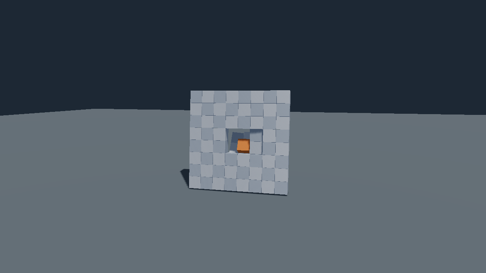

# Physics add-on

`c3d::physics` owns scene-bound rigid bodies, collision queries, joints, ragdolls,
fluid forces and pre-fractured breakables. Applications select `c3d_physics` and
its native dependencies; core does not import the package. Register physics on
the scene, create its world, and destroy the world before the scene/assets.

## Cloth

`c3d::physics::cloth` simulates a mesh over an owned geometry copy with pinned vertices, node
`Wind` drag, an optional ground and one-way contacts with the sphere and capsule colliders of the
bodies listed in `ClothDesc.colliders`. Attach with `scene.add_cloth(&assets, node, desc)` and
call `physics.update_cloths()` once after `physics.update`, after final ragdoll/IK poses and
`scene.update_world()`, before rendering. See [Cloth](../../docs/cloth.md) for the contract,
faults, frame order and measurements; the `cloth` example shows a flag and a cape on the ragdoll
character (`--scene flag|cape|both`). The manual Vulkan acceptance runs with
`c3c test cloth_acceptance --path addons/c3d_physics.c3l/test/gpu`.

## Replaced assets

A body keeps the collision snapshot it cooked when `replace_geometry` or `replace_texture` replaces its
source. Bodies created afterwards, and world rebuilds, cook the current revision. The geometry copy a cloth
owns is private to the cloth: do not replace or edit it.

## Breakables

A `Breakable` uses authored physical pieces below a root. It builds a hull-distance
graph and one native weld per connected pair. When a weld reaches its reaction
force threshold, the constraint is removed and a `BreakEvent` is reported. One
broken edge does not necessarily disconnect a piece from the remaining graph.

```c3
physics::register_physics(&scene)!;
PhysicsWorld world = physics::create_physics_world(
    allocator: mem,
    assets: &assets,
    scene: &scene,
    desc: physics::default_physics_desc(),
)!;
defer physics::destroy_physics_world(&world);

scene.update_world();
world.add_breakable(root, physics::default_breakable_desc())!;
```

The legacy `add_breakable` root must be a live non-scene-root node without a Mesh.
At least two Mesh nodes must occur below it. Each is an independent convex,
volume-spanning piece with positive unit scale and no skin/morph deformation.
Root and piece world matrices must be current, finite and rigid. Bake scale
into the asset. The initial ASSEMBLY form requires PARENT paths below its root;
the root itself may use either transform space.

For multiple render primitives or collision hulls per piece, use
`add_breakable_pieces(root, pieces, desc)`. Each `BreakablePieceDesc` holds a body
node's `Entity` and ordered piece-local `GeometryId` hulls. At least two distinct
live descendants are required; no piece may be an ancestor of another. Each
piece has at least one live hull, and may have any number of render children.
Material boundaries do not create physical pieces. The legacy convenience
still treats each Mesh descendant as one piece with one hull.

Both entry points share graph construction, body creation, wake and rollback.
PIECES uses one dynamic body per piece with one HULL collider per supplied hull;
ASSEMBLY uses one root body with a collider-to-piece map covering every hull.
Removing a render-only child keeps its body. All hulls contribute to body mass
and center of mass. Hull geometry must remain available for world rebuild.

A glTF primitive becomes a Mesh node. Use explicit body parents to group several
primitives into one piece; collision hulls are independent geometry. The supplied
`examples/assets/fractured_wall.gltf` uses the legacy one-primitive form with
64 separate mesh placements and narrow seams.

Distance at or below `contact_distance` connects two pieces. The smallest
qualifying hull-pair distance selects the weld anchor; exact ties keep the first
pair in caller hull order (first piece's hulls, then second piece's hulls).
Each unordered piece pair has at most one weld, in caller piece-pair order.
Edge/corner contacts also count; the rule does not measure shared face area. Overlap is accepted. The
example uses 0.5 m cubes on a 0.508 m pitch: face gaps are below the default
0.01 m threshold, diagonal gaps are above it, producing 112 welds.

## Fracture generation

Fracture generation is maintained in the standalone
[c3d_fracture.c3l](https://github.com/fesoliveira014/c3d_fracture.c3l) project under
the `fracture` namespace, with c3d as a dependency. This package accepts
authored hulls through `add_breakable_pieces` and retains captured recipes,
preparation, welds and break events. See [Fracture generation](../../docs/fracture.md)
for the project boundary.

## Pending fracture preparation

`scene.attach_breakable_pieces(&assets, root, pieces, desc)` copies a captured
recipe without creating bodies, cooked hulls or welds. Each `BreakablePieceView`
contains a live piece identity, ordered hull identities and the captured
root-relative rest frame. Caller arrays may be released after attachment. The
public `BreakableState` fields retain their existing layout; pending state has
no welds and `Breakable.is_prepared()` is false.

`world.prepare_breakable(root)` cooks the retained hulls, derives welds from the
retained frames and descriptor, and creates the requested initial representation.
It publishes a new state only after all preparation succeeds. The old state and
its borrowed arrays are invalidated on success. A prepared call is unchanged.
Failure leaves the pending recipe, nodes and earlier prepared owners unchanged;
staged native objects and hull holds are released. Correct a failed asset or
capacity condition and retry preparation.

`world.prepare_breakable_subtree(root)` attempts every owner under the selected
root and returns the first failure after completing the other owners. Omitting
`root` selects the whole scene. Normal physics updates leave unprepared owners
pending, including after world replacement. BodyStatus.PENDING still describes
native rebinding for owners that already completed preparation; it is separate
from `is_prepared()`.

The captured piece identity must still be live at preparation. Deletion and slot
reuse do not replace it. Captured hull order and rest frames remain unchanged.
Preparation derives candidate welds while temporarily holding cooked hulls, then
checks their current relative piece poses before staging bodies or native welds.
Position tolerance is the larger of 0.0001 metres and one millionth of the largest
absolute coordinate among the pair's current world positions and captured rest
positions. This covers accumulated float transform rounding at large world
coordinates. Angle tolerance is 0.0001 radians. A rigid motion of the whole piece
set is accepted. A displaced connected piece returns
`INVALID_ARGUMENT` and remains pending. Restoring its placement permits retry.
Bodies begin at their current piece-node poses; the assembly retains the matching
current collision frames separately from the immutable captured recipe.

`breakable.preparation_mismatch()` returns a read-only borrowed
`BreakableMismatch*`, or null when no mismatch exists. Its `piece_a` and `piece_b`
indices refer to the copied piece order. The borrow expires at the next
preparation or removal. Details clear before each preparation attempt and after
success. Callers identify the root from the node passed to preparation (or the
entity owning the component) and can report its path alongside the pair.

Attachment rejects dead piece/hull identities with `INVALID_ID`; empty hull
lists, duplicate/non-descendant pieces and fewer than two pieces with
`INVALID_ARGUMENT`; incompatible ownership with `BREAKABLE_EXISTS` or
`BODY_EXISTS`; non-finite/non-rigid rest frames with `UNSUPPORTED`; and failed
recipe allocation with `CAPACITY_EXCEEDED`. Every attachment failure adds
nothing. Pending owners show their ordinary authored piece nodes but have no
bodies or welds. `PhysicsWorld.prepare_breakable_subtree` requires a physics
world, live piece/hull sources and piece poses matching the recipe relations.
The eager `add_breakable` and `add_breakable_pieces` constructors attach and
prepare in one call, removing pending authoring on failure. Their existing
validation differences remain: the legacy mesh-tree constructor supports nested
mesh pieces, while the explicit-piece constructor rejects ancestor-related
pieces. Captured views support recipes produced by either constructor.

## Forms, ownership and faults

`default_breakable_desc()` selects ASSEMBLY: one enabled kinematic root body
with every piece hull. Pieces remain parent-relative and follow the root. A
qualifying dynamic-body hit changes it to PIECES: one dynamic body per
surviving piece, with its node committed to WORLD. Setting `sleep_until_hit`
false creates PIECES directly. `wake_breakable(root)` performs the transition
explicitly; a live PIECES call is a no-op.

`break_force` is finite nonnegative newtons, `contact_distance` finite
nonnegative meters, and density finite positive kg/m³. Surface coefficients
are finite/nonnegative and tangent velocity finite. The descriptor, geometry
identities and fracture layout are captured. Recreate to change them. Read
state through `scene.get(root, Breakable).state`; retain the root ID and
reacquire the component after structural changes. The state and its arrays are
library-owned. The component is 8 bytes on x64; its state/arrays are allocated
only for real breakables in one scene-allocator block.

`state.piece_view(index)` exposes the captured Entity, copied ordered hull IDs
and root-relative `rest_frame`. `state.weld_view(index)` exposes captured
endpoints, anchor and `frame_b` without damage or native joint state. Indices
must be below `state.pieces.len` or `state.welds.len`. Captured slots stay stable
after removal; callers check entity liveness. Hull slices borrow until
`remove_breakable` or component removal. The graph is derived from ordered
pieces, hulls, rest frames and `BreakableDesc`; there is no weld-list input.
Re-authoring the same captured inputs derives the same ordered graph.

Creation rejects overlapping breakables, existing bodies or conflicting
joint/ragdoll roles in the subtree, invalid geometry and unsupported transforms.
`BREAKABLE_EXISTS`, `BODY_EXISTS`, `INVALID_ARGUMENT`, `INVALID_ID` and
`UNSUPPORTED` identify those cases. Missing uncached hull source reports
`SOURCE_UNAVAILABLE`; snapshot exhaustion reports `CAPACITY_EXCEEDED`; native
constructor/hull faults propagate. No component-store capacity fault is invented.

Creation and wake are transactional for surviving pieces. Explicit wake first
prunes externally removed pieces; that cleanup remains even if transition
construction fails. Failed wake retains the remaining assembly and
visitor velocity, releases staged objects/holds and permits another request.
Automatic failures enter `build_failures()`. A failed or pending representation
cannot be explicitly awakened and reports `NO_BODY` until ready. On a new
world, pending piece bodies remain disabled until all surviving unbroken
edges can bind; terminal binding failure is recorded as FAILED. Source failures
follow the existing revision retry policy. Other failures require recreation.

Remove pieces through normal scene removal. The next physics update prunes
incident edges without a break report and removes their assembly collision
shapes and authored collider entries. World replacement cannot resurrect them.
Removing all pieces leaves an empty valid component. Use
`world.remove_breakable(root)` to remove owned bodies/welds while keeping nodes
and meshes; WORLD piece transforms stay WORLD. Removing only the raw component
releases graph state/welds but leaves authored bodies for application takeover.
Removing the root subtree releases everything through normal hooks.

## Update and event order

```c3
scene.update_world();
world.update(dt);
foreach (event : world.breaks()) {
    handle_break(event.root, event.piece_a, event.piece_b, event.point);
}
scene.flush_removals();
scene.update_world();
```

`handle_break` is application code in this function-body example. Consume node
borrows before removals. Reports reset once per update and accumulate across
its fixed steps. Capacity overflow increments the shared `dropped_events`
counter; a full or zero-capacity report buffer still allows wake and fracture.
The point is the authored weld anchor through the piece's current physics pose,
not a guaranteed impact point or seam centre. A single weld reports once.

Intact wake uses `mass * approach_speed >= break_force * fixed_dt`, plus the
world's hit-speed threshold. This is a wake heuristic. Weld fracture itself uses
the native solver's force threshold. Native event streams are consumed before
structural mutation, and only one qualifying hit is replayed per assembly/step.
Automatic wake uses the native assembly pose; manual wake uses its current
authored root pose. Fragments inherit assembly linear/angular motion. Staged
bodies are enabled before their captured velocities are restored, since the
native backend drops velocity writes on disabled bodies.

The visitor's relative normal point speed is restored after successful wake;
tangential and angular motion remain. This approximates first contact one step
later. It is not an exact collision-history reconstruction and imposes no
universal fracture latency. Both forms remain available. There are no static
anchors: an unanchored remainder may tip under a strong impact. Native
record/replay includes the body/joint mutations, but does not recreate scene
components or re-dispatch BreakEvent values.

## Rebasing the origin

After `Scene.shift_origin(offset)` and `scene.update_world()`, call
`physics.shift_origin(&scene, offset)` with the same offset (`offset.y == 0`). It
subtracts the offset from every body's pose through `set_transform`, including static
bodies, then rebuilds the static tree once. Velocities, sleep state, joints, welds and
contacts are kept, so a resting stack stays asleep. Cloth positions, pin anchors and
targets, collision shapes and the sampled body poses move with it; nothing allocates.
Call it between `end_frame` and the next `physics.update`. A recording captures the
shift as `set_transform` calls of every body, and replay reproduces it. The
`FluidSurfaceFn` of buoyancy belongs to the application and must follow the shift.
See `docs/large_world.md` for the full order.

## Example and checks

```powershell
python scripts/build.py --example breakable
addons/c3d_physics.c3l/build/breakable.exe --pieces
addons/c3d_physics.c3l/build/breakable.exe --model addons/c3d_physics.c3l/examples/assets/fractured_wall.gltf
addons/c3d_physics.c3l/build/breakable.exe --frames=120 --acceptance --capture=fracture.rgba
c3c build breakable --path addons/c3d_physics.c3l -O3
addons/c3d_physics.c3l/build/breakable.exe --benchmark
```

Left click launches a box; right drag orbits and the wheel zooms. Rebuild applies
the strength/form controls and clears projectiles. The demonstration uses a
40,000 N weld threshold and a dense 1,000 kg projectile at 15 m/s, independently
of the library's 2,000 N default. `--walls 32` shows the multi-wall case.
Capture files are 1280×720 RGBA8 scene pixels. The GPU example always enables
Vulkan validation. WSL is restricted to builds and CPU tests.

The CPU benchmark reports authoring cost for one 64-piece wall, 32-wall update
cost, native body/joint/awake counts, observed wake/break step indices, and
native replay verification. It uses three runs, 300 warm-up and 600 measured
60 Hz updates. Idle uses maximum strength to retain the complete graph; no
claim is made that PIECES has actually entered native sleep. A separate impact
check verifies that the demonstration strength survives warm-up before a hit.
On Windows x64, i9-14900K, C3 0.8.3 `-O3`, the median of three run means was:

| Form | Author one 64-piece wall | Update 32 walls | Bodies | Weld joints | Awake bodies |
| --- | ---: | ---: | ---: | ---: | ---: |
| ASSEMBLY | 0.2359 ms | 0.004760 ms | 33 | 0 | 0 |
| PIECES | 0.2409 ms | 0.084900 ms | 2049 | 3584 | 0 |

Body counts include the ground. Geometry/node creation and world-transform
publication are outside the timed regions. The complete 112-edge graph stayed
intact during warm-up and measurement. These numbers describe this workload,
not a general scene budget.

The impact probe first hit at step 10. ASSEMBLY woke at step 10 and reported its
first break at step 11; PIECES reported its first break at step 10. Both native
recordings replayed all 600 frames with matching hashes. The component measured
8 bytes and each BreakEvent 40 bytes. The rendering example was validated
separately on the Windows RTX 4090 host.



Run `python scripts/build.py --test` for the full CPU matrix, or
`c3c test physics_test --path addons/c3d_physics.c3l` for the package. The breakable
cases cover ownership, rollback, native thresholds, removed assembly shapes,
world replacement, overflow, publication and motion inheritance.
