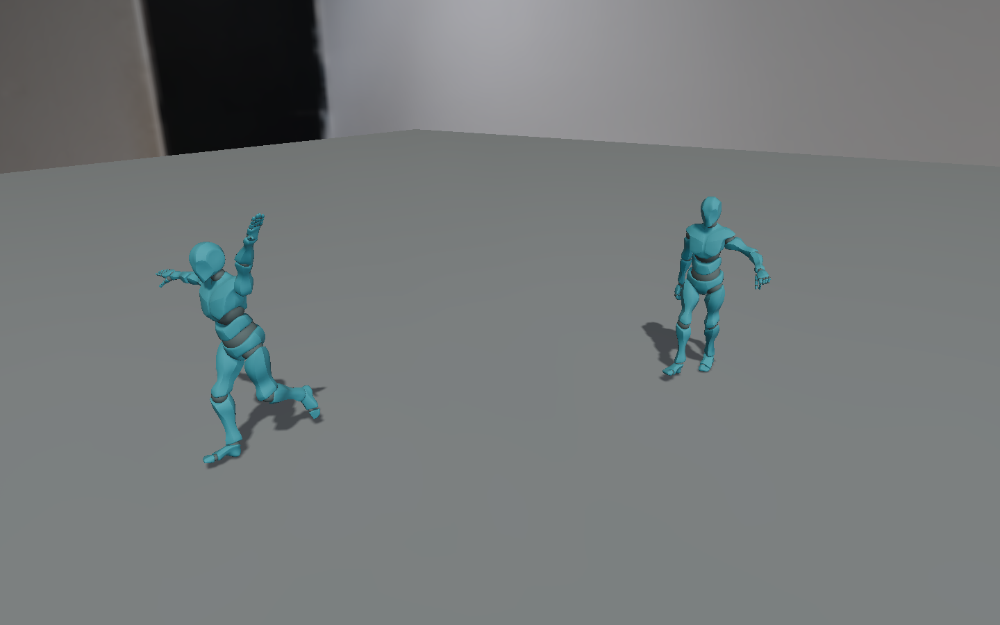

# Animation

`c3d::anim` plays the clips a model import stored onto a model instance. The
application owns the update sequence; nothing in the scene graph or the
renderer advances an animation.

## Update sequence

```c3
anim::update(&assets, &scene, dt);
scene.update_world();
renderer.render(&scene, camera_node)!;
```

`anim::update` advances every action, samples its clip and writes the local
transforms of the instance nodes and the morph weights of the instance meshes.
`Scene.update_world` turns the locals into world matrices. The renderer reads
the pose it finds. Physics and IK, when present, run between the animation
update and the final `update_world` ([Inverse kinematics](#inverse-kinematics)).

## Animator and actions

An `Animator` is a component on the synthetic root that `model::instantiate`
returns. It owns a fixed pool of 16 actions, addressed by `AnimationActionId`.
The pool header, live-ID order, events, 1D spaces and model-sized boolean mask
rows share one per-animator heap block. Prepared 2D spaces use a separate fixed
block. Optional inertial history and residuals also use fixed owner storage.
The scene component contains pointers, counts and the last motion delta.

The fixed component store reserves a value for every possible scene node,
including unused slots: `scene_capacity * Animator::size`. The default scene
has 16,385 slots, including its root. ECS index arrays and allocations for live
animators are additional.

```c3
Node* left = model::instantiate(&assets, &scene, model)!;
Node* right = model::instantiate(&assets, &scene, model)!;
ClipId[] clips = scene.get(left, ModelInstance).clips;

Animator* left_animator = anim::add_animator(&scene, left);
left_animator.play(&assets, clips[0])!;

Animator* right_animator = anim::add_animator(&scene, right);
AnimationActionId run = right_animator.play(&assets, clips[1])!;
right_animator.action(run).speed = 1.5f;
```

`play` validates the clip's model-local targets and returns its ID at time zero,
weight one, looping. It faults
`INVALID_ID` for a dead clip and `INVALID_ARGUMENT` for a clip that does not
fit the instance (a target beyond the node table, a morph target outside its
mesh table, or a present mesh with a different morph count), or an invalid
layer, fade or mask.
`CAPACITY_EXCEEDED` means all 16 action slots are live. `stop(action)` removes the action;
`stop(action, seconds)` fades it out first. `cross_fade(from, to, seconds)`
fades one action out while the other fades to full weight. Use
`play(&assets, clip, { .fade_in = seconds })` to start at zero and fade in.
Both stop and cross_fade return optionals: stale IDs fault `INVALID_ID`, invalid
durations or a cross-fade to the same ID fault `INVALID_ARGUMENT`. They validate
before changing either action. This includes IDs whose fade-out already ended.

IDs survive other plays/removals and are meaningful only with the animator that
issued them. A removed generation never resolves to its replacement while that
animator lives. Destroying/recreating the animator starts a new owner; discard
its old IDs.
`try_action(id)` faults `INVALID_ID`; `action(id)` borrows a known-live action.
Retain IDs and reacquire action pointers after structural action operations;
reacquire Animator pointers after component-store changes. Iterate
`order[:action_count]` for live IDs in play order.

`Action.time`, `speed`, `weight`, `loop` and `playing` are runtime controls;
numeric values must be finite and weight nonnegative. `playing` gates only the
clock, so paused actions still pose. Clip, layer, additive mode, masks and
reference arrays are captured/library-owned. Recreate an action to change them.
Clip tracks, duration and target mappings must remain unchanged and live during
playback. Root mode/yaw, generalized extraction and sampling data are captured
too. Blend-space members are read-only; their space controls playback.

While an animator exists it owns the pose of its instance: every update writes
every present instance node's local transform and every present instance mesh's
morph weights.
The synthetic root is not an instance node and stays under application control,
so moving or spinning an instance as a whole is unaffected. Removing the root
removes the animator and its arrays through the ordinary component hook; the
shared clips stay in the store.

## Replacing clips and models

A clip replacement keeps its track layout (see [Models](models.md#replacing-geometry-skeletons-and-clips)), so playback
re-seeks on the next update. A model replacement may grow the template's clip list. Crowd actions accept any live clip
compatible with their captured node and morph layout, including clips outside that list. Cursors are allocated at play
or seed replacement, so a longer compatible clip does not require recreating the crowd.

## Removed instance nodes

`ModelInstance.present_node(template_index)` borrows the original node or returns
null after removal. Each pointer has a captured `Entity` identity; slot reuse
cannot bind a template index to the replacement node. The captured identities,
node table, authored baselines and mesh indices retain their original extents.
They are library-owned and must not be rebound. Use the accessor before reading
a template node; `Animator.nodes` is only a borrowed alias of the pointer table.
The identity check follows the scene's generational-ID lifetime assumption:
a stale identity must not survive generation wrap and become equal again.

Animation skips tracks for absent nodes and morph tracks for removed `Mesh`
components. A missing root-motion target contributes no motion. Actions retain
their clips, modes, masks and playback state, and surviving tracks continue.
Reparenting a live template node outside the instance subtree preserves its
identity and animation membership.

`SkinBinding.joints` remains a borrowed array of live joint nodes. Every joint
must stay live while its binding is used for skinning, bounds or joint search.
Remove dependent bindings before removing their joints; the model accessor
does not make dead skin joints recoverable.

## Layers and masks

`PlayDesc.layer` selects one of four layers, folded in ascending index. Layer 0
starts from the authored baseline; upper layers start from the result below.
Play order does not change the order of layers. A channel with no contribution
on a layer retains its lower result.

Masks address model-local nodes, including morph-bearing mesh nodes. Their
storage is sized once from the model; there is no 512-node limit. The caller
owns a `JointMask`, and play copies it into one of the animator's preallocated
mask rows. A null mask selects all nodes; an all-false mask selects none.

Inside a fallible function, after adding the animator, with a live model and
an overlay clip targeting that model:

```c3
String[1] names = { "mixamorig:Spine1" };
JointMask upper = anim::create_joint_mask(mem, &assets.model(model).data, names[..])!;
defer anim::destroy_joint_mask(&upper);

AnimationActionId overlay = animator.play(&assets, overlay_clip, {
    .fade_in = 0.2f,
    .layer = 1,
    .mask = &upper,
})!;
animator.action(overlay).weight = 0.5f;
```

Use the model's actual names. Every exact match is selected; descendants are
included by default. Pass `include_descendants: false` for only matching nodes.
A missing name faults `NOT_FOUND` before allocation. Repeated requested names
are harmless and an empty name list produces empty membership. Play rejects a
mask with a different node count. Reuse a mask only with instances of the model
whose indices it describes. Destroying/editing the input mask after play does
not alter existing actions.

### Weighted and feathered masks

`PlayDesc.weighted_mask` borrows a caller-owned `WeightedJointMask` during play
instead of a boolean mask. `create_weighted_joint_mask(allocator, assets, model, names,
weights)` selects exact names with finite weights in `[0,1]`; every matching
node participates, and repeated entries combine by maximum. An empty list
selects no nodes. `NOT_FOUND` identifies a missing name.

`create_feathered_joint_mask` also takes one depth per named seed. At descendant
distance `d`, seed weight `w` contributes
`w * min(1, (d + 1) / (depth + 1))`. The seed participates: weight 0.8 and depth
3 give 0.2, 0.4, 0.6 and 0.8 at distances 0 through 3, then remain at 0.8.
Depth zero selects the whole subtree at `w`; overlapping seeds combine by
maximum, independent of order.

```c3
String[1] names = { "DEF-spine.001" };
float[1] weights = { 0.8f };
uint[1] depths = { 3 };
WeightedJointMask upper = anim::create_feathered_joint_mask(
    allocator: mem,
    assets: &assets,
    model: model,
    names: names[..],
    weights: weights[..],
    depths: depths[..],
)!;
defer anim::destroy_weighted_joint_mask(&upper);

animator.play(&assets, overlay_clip, { .layer = 1, .weighted_mask = &upper })!;
```

Use the model's actual names. A weighted mask captures the model identity and
ordered node names/parents. A different model or changed layout, wrong row
width, invalid weight, or supplying both mask types faults `INVALID_ARGUMENT`
before playback changes. Play copies the float row; editing or destroying the
caller mask afterwards does not change existing actions. Each masked action
owns `node_count * float::size` extra bytes until removal.

The effective contribution is `action.weight * mask.nodes[node]` for every
translation, rotation, scale and logical morph channel, including root motion.
Masked and zero-weight advancing actions still emit events. Boolean masks keep
their existing API and storage.

### Regular blending

Each channel (translation, rotation, scale, and each morph weight array) is
blended separately against the lower layer's value (the authored baseline on
layer zero):

```plain text
total    = sum of effective weights for actions animating this channel
residual = max(0, 1 - total)
value    = (sum of weight * sample + residual * below) / max(1, total)
```

A lone action at weight 0.25 sampling translation 8 over baseline 0 yields 2.
A rotation-only clip leaves translation and scale at their authored values. Two
actions at weight 1 average. Rotations are sign-aligned to the lower pose's
hemisphere before summing and normalized afterwards.

## Additive actions

Set `PlayDesc.additive = true`. Play captures each track's sample at time zero
once, including the value rather than tangent fields of cubic keys. Each layer
first folds regular actions, then applies its additive actions in play order.

Translation and morphs add `weight * (sample - reference)`. Scale defaults to
`AdditiveScaleMode.DIFFERENCE` and uses the same difference formula. Rotation
uses `reference.conjugate() * sample`, aligns that delta to identity, interpolates
from identity by weight, then postmultiplies the current rotation and normalizes.
Additive order matters for noncommuting rotations. A time-zero action adds
nothing; a half-weight 45-degree delta applies 22.5 degrees. Both mask types
apply to every channel.

Opt in to componentwise scale ratios with
`PlayDesc.additive_scale = AdditiveScaleMode.MULTIPLICATIVE` on an additive
action. After regular blending, each additive action applies:

```plain text
below *= 1 + effective_weight * (sample / reference - 1)
```

For below `(2,3,4)`, reference `(2,4,8)`, sample `(4,2,16)` and weight 0.5,
the result is `(3,2.25,6)`. The scale mode and time-zero reference are captured
at play. Every scale track and its reference must stay finite and strictly
positive across its full domain. Admission checks STEP/LINEAR keys and cubic
interior extrema once. Nonpositive domains return `INVALID_ARGUMENT` before
creating an action or group. CUBIC segments also need an exact minimum of at
least `FLT_MIN + 2^-40 * M`, where `FLT_MIN = 2^-126` and `M` is the largest
magnitude of a key or duration-scaled tangent. This directed margin covers the
double sampler error and keeps its float result positive. Positive curves below
the margin return `UNSUPPORTED` before mutation. STEP and LINEAR retain their
key-only checks, including positive subnormals. Runtime applies no clamp or
repeated domain scan.

An additive action keeps the reference pose it sampled at `play` until it is played again. After
`replace_clip_owned`, running actions re-seek on the new tracks, but an additive action's reference pose and
the root-motion state stay as sampled from the old clip until the action is played again.

Animation owns the final pose until later physics/IK writers run. There is no
scheduler or automatic motion consumption. Root motion and events are outputs for
the application to consume. Per-frame
scratch remains in the existing temporary allocator; captured masks, reference
samples and cursors retain their resource lifetimes.

## Root motion

`PlayDesc.root_motion` defaults to `RootMotion.KEEP`. Runtime `STRIP_XZ` pins
root X/Z at the clip's first sample and retains vertical motion. `EXTRACT` pins
the same channels and publishes `Animator.root_motion`; animation never moves
the instance root. Import clips with `RootMotion.KEEP` to retain this data.
The enum and `NO_ROOT_NODE` now belong to `c3d::anim`, including when used in
`RetargetOptions`.

```c3
animator.play(&assets, walk, { .root_motion = RootMotion.EXTRACT })!;
anim::update(&assets, &scene, dt);
anim::apply_root_motion(instance_root, animator.root_motion);
scene.update_world();
```

The selected root is the first skin's first joint whose parent is outside that
skin. An unskinned model defaults to `NO_ROOT_NODE`; set `animator.root_node` to
a model-local index before playing to override it. Keep the selection fixed
while actions live. Root and intermediate ancestors use `PARENT` transform
space. Ancestors between the joint and instance root must retain their authored
transforms; their basis is captured at play. The instance root itself may use
either transform space.

`root_yaw = true` additionally removes the root rotation's Y twist and emits
the turn about the root node's reference position; tilt remains in the pose.
The reference position includes static ancestors in the instance root's frame.
Extraction requires upright, positive,
uniform scale through the captured basis and instance root, retained throughout
playback. This default planar path requires static ancestors and Y-up;
use generalized extraction for other supported frames.
Missing root configuration, unsupported yaw basis, yaw with KEEP, and non-KEEP
additive actions fault `INVALID_ARGUMENT` before allocating an action.

Deltas are planar transforms in the instance root's frame. The helper applies
translation through the node's authored rotation/scale, then postmultiplies the
turn. Apply each delta once; it resets to zero translation and identity rotation
every update. Reverse and multi-loop updates compose cycle transforms. A single
action's consumed path is invariant under subdivision within sampling tolerance.
Repeated float32 motion application accumulates position drift as travelled
distance grows; use the carrier's frame when comparing its controlled pose.
Masks and regular layer weights apply to motion as to pose; KEEP/STRIP root
channels contribute zero motion with their weight. A half-weight extractor
therefore emits half displacement. Yaw contributions use signed shortest turns;
mixing actions does not promise subdivision-invariant blended trajectories.

`Action.time` edits seek to a new starting sample. The seek itself emits no
motion or events; the subsequent clock step does. Internal double clocks retain
subframe precision independently of the public float sampling time. `dt` is
finite and nonnegative, speed may be negative, and clocks must remain finite
and representable. Paused, zero-step and zero-duration actions emit no movement.

### Generalized extraction

Set `PlayDesc.extraction.generalized = true` with `root_motion = EXTRACT` to
consume motion from the final composed ancestor chain. `translation_axes`
selects X, Y and Z in the instance-root frame; `up` is a finite unit vector in
that frame, and `twist` selects turning about it. These captured fields replace
the planar `root_yaw` selection for that action. Keep the motion node and frame
fixed while its actions live.

```c3
animator.root_node = motion_node;
animator.play(&assets, walk, {
    .root_motion = RootMotion.EXTRACT,
    .extraction = {
        .generalized = true,
        .translation_axes = { true, true, true },
        .up = { 0, 1, 0 },
        .twist = true,
    },
})!;
```

The chain may contain animated proper rotations, translations and finite
positive uniform scales. Nonuniform scale, reflection, shear, invalid root
layout, nonfinite values and zero quaternions fault `INVALID_ARGUMENT` at
admission. Rotation tracks are checked over their full domain; STEP uses keys,
LINEAR also requires a sign-corrected nonnegative endpoint dot, and CUBIC uses a
bounded polynomial certificate. An unproved cubic domain or sampling margin
faults `UNSUPPORTED` before playback changes. No repeated domain scan runs at
update. Under generalized extraction, a nonneutral scale track on an additive
action's consumed chain is invalid in either additive scale mode, including
zero-weight or fully masked actions.

The final blended and inertia-corrected chain determines the consumed motion.
One instance-root compensation applies to every top-level branch, including
branches outside the motion node, so applying the published delta reproduces
the corresponding KEEP pose. The root turns about its reference position in
the instance-root frame. Consume the delta with `apply_root_motion` once after
update; for crowds use `Scene.apply_crowd_root_motion`. The default planar path
keeps its previous behavior. Float32 application still accumulates drift with
distance; compare articulated poses in their carrier's frame.

## Inertial transitions

Reserve storage when creating an Animator:

```c3
Animator* animator = anim::add_animator(
    &scene, instance_root, { .inertia_enabled = true });
```

For a crowd, set `AnimatedCrowd.inertia_enabled = true` after `attach_crowd`
and before `prepare_crowd`. Preparation fixes this option; changing it on a
prepared owner is invalid. A crowd reserves separate history/residual rows for
its full capacity, including inactive placements, and shares evaluation scratch.
Each row owns a previous node pose, double velocity/offset/offset-rate rows and
28 bytes per logical morph component, plus controls and root-motion state.
Disabled owners reserve none of this storage. Enabled updates allocate nothing.

`Animator.inertialize` and `CrowdPlayer.inertialize` replace the owner's current
actions and groups, preserving the current composed pose and its published
velocity with a residual that decays over `duration` update seconds. Duration
zero switches immediately. The action array and optional `CrowdSpaceAuthoring`
array are borrowed during the request and copied; group membership names the
target action ordinals.

```c3
AnimationTargetDesc[1] targets = { anim::ANIMATION_TARGET_DEFAULT };
targets[0].clip = run;
targets[0].start_time = 0.25f;
targets[0].speed = 1.25f;
animator.inertialize(&assets, {
    .duration = 0.35f,
    .actions = targets[..],
})!;
```

The request first validates every target and its eligibility, then allocates
all target cursors, references and copied masks into temporary ownership.
Failures free those resources and leave the current actions, IDs, order, pose
and history unchanged. Source retirement and target installation follow only
after that succeeds. Requests need no spare action slots: 16-to-16 replacement
and a crowd's full configured action capacity are supported. Request-time
allocations follow the ordinary play contract; the inertial history and
residual storage was already reserved at preparation. Old source action IDs
become stale after a successful request. Reacquire action and group pointers.

A replacement while active captures the current corrected output and its
published velocity. Pose translation, rotation and ordinary scale/morph
residuals preserve value and velocity at onset and decay to the target. Scale
on a consumed motion chain uses `s_target * exp(residual)` in log space, keeping
positive uniform scale positive and velocity-matched. Regular blending is
convex, so admitted positive-uniform scales remain positive under runtime
weights, masks, fades and group controls. Request-time bounds also require the
whole corrected scale window to remain representable as float. A proven
out-of-range result faults `INVALID_ARGUMENT`; a result within the directed
rounding margin faults `UNSUPPORTED`. A shorter transition duration may succeed;
the runtime does not clamp accepted scale.

For a consumed root, source and target use the same motion node, selected axes,
up, twist and frame. Different clip reference positions are allowed and rebase
to the current consumed carrier anchor. Root output adds a decaying residual
translation/twist velocity to the target delta, with one final pivot correction.
Events come from target actions only. The source's previous published delta
divided by its positive update interval supplies velocity; invalid history
starts with zero source velocity.

At a STEP boundary, request onset takes the one-sided value and derivative in
the target playback direction, including reverse starts at duration. It does
not epsilon-seek the clock or emit events. A zero update freezes transition
time. `cancel_inertial_transition` discards the residual while retaining target
actions and clocks; the next pose is the target output. Inertial requests and
cancellation require enabled storage (`@require`), rather than returning a fault
for a disabled owner. A stale crowd player still faults `INVALID_ID`.

Clips, model layout and captured references must remain live and compatible
through playback. Recreate actions when changing captured motion settings or
reference data. Removing an owner releases its history and target resources;
replacing a crowd placement resets that slot's generation and history. Seeks,
removed targets, relevant clip/model revisions and layout changes invalidate
affected history; captured references are not silently rebuilt. Saving
keeps authored settings and target playback, while sampled clocks, source
velocities, history and active/interrupted residuals restart empty on restore.

## Clip events

```c3
ClipEvent[2] footsteps = {
    { .time = 0, .id = 1 },
    { .time = assets.clip(walk).data.duration * 0.5f, .id = 2 },
};
assets.set_clip_events(walk, footsteps[..])!;
```

The setter copies and stably sorts events by time. IDs are application-defined;
no callback is installed. Invalid times (nonfinite or outside `[0,duration]`)
fault `INVALID_ARGUMENT`; a dead clip faults `INVALID_ID`. Failure leaves the
old table intact. Replacing a table between updates is valid. `add_clip_owned`
instead takes ownership of an already sorted valid table. Retargeting copies
events into independent owned arrays.

### Imported tables

A glTF animation imports a versioned table from `animation.extras.c3d_events`:

```json
{"c3d_events":{"version":1,"events":[{"time":0.25,"id":7}]}}
```

For FBX, the animation stack's string property `c3d_events` contains the inner
JSON object, `{"version":1,"events":[{"time":0.25,"id":7}]}`. Both importers
read it whenever `LoadOptions.animations` is enabled, including store-free
and asynchronous loading. Animation-only and profiled FBX loading read the
same property. Disabled animation imports do not read event metadata.
Absent metadata or an empty array produces an empty table. Replacing a clip
replaces its table, so absent metadata clears previously imported events.

`version` and `id` use the exact value of each JSON number token. Integral
spellings such as `1`, `1.0`, `1e0` and `10e-1` are equivalent. IDs range from
0 through 4294967295; repeated IDs and negative-zero spellings are valid.
Fractional, negative nonzero or overflowing IDs fault `ASSET_FORMAT_ERROR`.
A nonintegral version faults `ASSET_FORMAT_ERROR`; any integer version other
than 1 faults `UNSUPPORTED`, including integers beyond 64 bits.

`time` is finite decoded clip-local seconds in `[0,duration]`, read as double
and stored as float. Events never extend the track-derived duration; a
zero-duration clip permits only time-zero markers. FBX uses the decoded origin
after baking with `trim_start_time = true`. Author markers against the resulting
clip times, including when the source stack starts before or after zero.
Do not use the stack's absolute scene times.

Missing required fields, wrong types, malformed recognized metadata and invalid
values fault `ASSET_FORMAT_ERROR`. Repeated decoded keys within the table object
or any direct event entry also fault, including unknown keys and escaped spellings
of the same key. Single unknown fields, duplicates inside nested unknown values,
and unrelated extras or properties are ignored. Unrelated glTF numeric values
do not inherit the event ID or version limits. Import failure leaves shared
assets unchanged and releases decoded event arrays.

Imported events are stably sorted by time, retaining authored order at equal
times. The table owns its explicit IDs and has no event names or payloads.
[Serialization](serialization.md) saves keyed clip references rather than clip
payloads or event tables; preload the imported assets before restoring playback.

### Event delivery

After update, read `animator.events[:animator.event_count]`. Each `FiredEvent`
contains action ID, clip ID, authored ID and time. Every retained advancing
action reports, including zero-weight blend-space members. Fully faded actions
are removed before publication. Delivery follows action play order, then time
crossing order within each action; equal-time markers keep their authored order.
Applications can filter by current action weight, as the Mixamo example does.

Forward intervals include the starting instant and exclude the ending instant;
reverse intervals do the opposite. Terminal endpoints are included when a
non-looping action stops. At a loop seam, the closing marker (duration forward,
zero backward) fires on arrival; the opening marker fires on continuing into
the next cycle. A step spanning both delivers closing before opening. Reverse
playback from zero starts at the equivalent duration boundary. Pauses and seeks
alone fire nothing. The fixed buffer retains the first 16 crossings per update;
`events_dropped` counts the rest, saturating at `uint::max`. Both counts reset
every update. Large time steps count crossings without iterating elapsed loops.

## One-dimensional blend spaces

```c3
ClipId[2] locomotion = { walk, run };
float[2] positions = { 0, 1 };
BlendSpace1D* space = animator.add_blend_space(
    assets: &assets,
    clips: locomotion[..],
    positions: positions[..],
    desc: { .root_motion = RootMotion.EXTRACT },
)!;
space.parameter = 0.5f;
```

An animator owns two fixed space slots shared by 1D and 2D groups. A 1D group
has 2–8 actions. Positions must be finite and strictly ascending, and clip
durations finite and positive. Dead clips fault `INVALID_ID`, invalid inputs/configuration fault `INVALID_ARGUMENT`,
and exhausted space/action slots fault `CAPACITY_EXCEEDED`. Creation rolls back
all new actions on failure.

The parameter clamps to the authored range. Only its two neighbors receive
weights, summing to `space.weight`. All members share a normalized double phase
advanced by `dt * speed / weighted_duration`; group weight does not affect speed.
Set `playing = false` to pause the phase while still adjusting the blend. Keep
parameter/speed/phase finite, phase in `[0,1)`, and weight in `[0,1]`.

The space owns member time, weight, loop, playing and fade fields. Members are
looping with `playing = false`; root motion and events use their shared clock.
Independent stop/cross_fade faults `INVALID_ARGUMENT`. Use
`stop_blend_space(space, fade_out)` or
`fade_blend_space(space, target_weight, duration)` instead. Fade-to-zero removes
every member. Pointers are short-lived borrows: reacquire through
`animator.blend_spaces[slot]` after animator-store changes and discard after
removal/reuse. The inspector exposes group controls and displays member state.

## Two-dimensional blend spaces

Supply explicit sample coordinates and their triangulation:

```c3
ClipId[3] clips = { idle, walk_left, walk_right };
Vec2[3] coordinates = { { 0, 0 }, { 2, 0 }, { 0, 2 } };
BlendTriangle[1] triangles = { { .indices = { 0, 1, 2 } } };
BlendSpace2D* space = animator.add_blend_space_2d(
    assets: &assets,
    clips: clips[..],
    coordinates: coordinates[..],
    triangles: triangles[..],
)!;
space.parameter = { 0.5f, 0.5f };
```

A group has 3–16 members on an Animator, or 3–`actions_per_instance` on a crowd.
Every member consumes an ordinary action slot. Two 1D groups, two 2D groups or
one of each fill the same two-slot budget. Crowd capacities below three cannot
admit a 2D group.

Coordinates must be distinct and finite. Triangles must form a connected,
non-overlapping triangulation of the convex hull, include every sample and have
valid distinct indices. Winding is normalized at admission; gaps, crossings,
duplicate triangles, unused samples and non-convex boundaries fault
`INVALID_ARGUMENT`. For maximum coordinate extent `S`, triangle double-area
must exceed `1e-10 * S*S`. No automatic triangulation or degenerate fallback is
performed. Clips must be live and have finite positive durations. Exhausted
slots/actions or failed allocation return `CAPACITY_EXCEEDED`; dead IDs return
`INVALID_ID`. Failure preserves existing actions, groups and output.

An exact coordinate selects that authored sample. Otherwise the first authored
containing triangle supplies up to three nonnegative barycentric weights.
Boundary roundoff within `1e-7` is clamped to zero and normalized. Outside the
hull, the parameter projects onto the nearest boundary segment. Distance ties
within `1e-12 * S*S` choose the earliest authored triangle-edge occurrence.
Selection does not depend on the previous parameter.

Selected weights sum to `space.weight`; the selected durations advance the same
normalized phase law as 1D. All members retain their shared clocks and event
semantics, including unselected and zero-weight members. Pausing the phase still
allows parameter edits to change the pose. Keep parameter, speed and phase
finite, phase in `[0,1)`, and weight in `[0,1]`.

Use `stop_blend_space_2d(space, fade_out)` and
`fade_blend_space_2d(space, target_weight, duration)` for group removal and fades.
Independent member stop/cross-fade returns `INVALID_ARGUMENT`. Creation copies
coordinates, triangles and captured masks; caller arrays may be changed or freed
afterwards. Group arrays and member configuration stay library-owned and
read-only. The returned pointer is a short-lived borrow; reacquire from the
owner's 2D slot storage after structural changes and discard it after removal.

### Prepared storage

Every playback owner prepares two 2D rows even when neither is active. For action
capacity `A`, each row holds `A` action IDs, `A` coordinates, up to
`max(0, 2*A - 5)` three-byte triangles and `A` two-byte hull edges. On x64 the
control is 128 bytes, aligned to eight bytes. Both rows share one allocation;
these totals include controls and alignment padding:

| Action capacity | Retained 2D bytes per playback owner |
| ---: | ---: |
| 1 | 304 |
| 2 | 336 |
| 3 | 384 |
| 4 | 432 |
| 8 | 624 |
| 9 | 672 |
| 15 | 960 |
| 16 | 1008 |

An Animator pays 1008 bytes. A crowd pays the table value for every slot of its
fixed capacity, including inactive slots. These bytes exclude existing 1D rows,
actions, cursors, additive references and weighted mask rows. Group updates
allocate nothing; creation allocates only the members' captured action data.

## Authoring example and inspector

```bash
python3 scripts/build.py --example animation_authoring
```

`animation_authoring` pairs a crowd with an ordinary Animator for the unmodified
CC0 Quaternius animations and AnimatedMorphCube. Its panel controls a nine-sample
2D direction, speed, pause, a feathered upper-body/morph overlay and a
multiplicative head-scale overlay. Character buttons request layered playback,
a generalized jog or the source's left/right 90-degree turning clips through
inertial transitions. Transition duration, cancellation and extracted movement
are explicit controls; each owner consumes its output once per update.
The Animator inspector exposes 2D parameter,
weight, speed, pause and stop controls, and shows copied weighted-mask membership
and the additive scale mode. Captured mask/layout/scale settings change by
recreating their actions or groups.

Animator authoring version 3 and AnimatedCrowd version 4 retain these settings,
generalized extraction and the inertia opt-in through `c3d_serial`. Earlier
versions retain their authored groups, masks and scale mode, default to planar
extraction and disabled inertia, and preserve the original 1D/boolean/DIFFERENCE
defaults where those features were absent. Playback clocks, fades and transitions
follow the authored restart rules ([Serialization](serialization.md)).

## Layered example and CPU measurements

`mixamo` shows a regular masked wave on the left and an additive wave on the
right, both over locomotion. The wave is authored at setup from the loaded
model's rest pose and `Spine1`/`LeftArm`/`LeftForeArm` names; missing joints disable
that demonstration with a message. No extra animation download is required.
`W`/`S` adjust the left walk/run blend; `R` toggles applying its extracted motion.
`G` and `A` toggle the waves, `1`–`9` cross-fade the right in-place clip, `Q` changes
the space weight and Space pauses. Authored footsteps from the dominant member
print to the console. The Scene panel's animator inspector shows clip IDs, layer,
mode, mask count and playback controls; stop is applied after traversal.

The animation, IK and Mixamo examples accept `--frames=100 --acceptance` for a
bounded validation run that exercises playback changes. Mixamo additionally
accepts `--capture=path` for a 1440x900 RGBA8 scene capture.

```powershell
c3c build mixamo --path examples -O3 --lib c3d_profile -D C3D_PROFILE_CPU -D C3D_PROFILE_INTERNAL
examples/build/mixamo.exe --benchmark
```

The CPU-only benchmark reads the existing `anim.update` capture scope for one
Mixamo instance. It warms 300 updates and measures 5,000 at a fixed 60 Hz step;
loading, mask creation and reference sampling are outside the measured interval.

The measurements below used a 152-byte Animator component before 2D authoring
storage was added. They do not include its prepared 2D block or weighted action
rows. Current retained costs follow the component and prepared-storage formulas
above.

Windows x64, i9-14900K, C3 0.8.3 `-O3`, CPU+INTERNAL profiling; medians of three
run means:

| Case | Nodes | Tracks | Actions | CPU mean |
| --- | ---: | ---: | ---: | ---: |
| Single action before runtime motion | 69 | 105 | 1 | 0.001157 ms |
| Single action with runtime support | 69 | 105 | 1 | 0.001191 ms |
| Base plus masked regular wave | 69 | 312 | 2 | 0.002727 ms |
| Base, masked regular and additive waves | 69 | 519 | 3 | 0.006146 ms |
| Two-clip space with extracted motion | 69 | 210 | 2 | 0.002320 ms |
| Equivalent three base actions plus masked layer, before | 69 | 522 | 4 | 0.003476 ms |
| Three-clip space with motion plus masked layer | 69 | 522 | 4 | 0.003745 ms |

The comparison baseline is `b103615`. The three-clip workload uses walk, run and
a repeated walk slot, parameter 0.5: neighbor weights 0.5/0.5 and an inactive
third neighbor, plus the masked wave. The baseline uses the same clips/weights
with independent clocks; it has no space or runtime extraction. This compares
the equivalent pose workload before and after adding phase and motion work.
Single-action run means ranged 0.001150–0.001180 ms before and
0.001186–0.001346 ms after; four-action means ranged 0.003421–0.003558 ms before
and 0.003631–0.003759 ms after. These measurements do not justify an executor.
They do not establish performance at crowd scale. WSL verification is build/CPU
only.

The benchmark also consumes ten walk loops at 60 Hz (a shortened final step),
then compares displacement with ten clip cycles. This rig travels 17.695213 m
with 0.000017166 m drift, below the 0.001 m limit. This is a CPU motion check;
no GPU timing is included. The default example separately runs with Vulkan
validation on Windows.



## Sampling

`sample_track` clamps to the key range, steps forward from the previous key
through the action's cursor and re-seeks by binary search after any backwards
jump, so wraps, seeks and negative speeds cost one search. `STEP` holds the
previous key; `LINEAR` interpolates per element, with rotations taking the
short path and using slerp when the keys are more than 0.1 rad apart;
`CUBIC_SPLINE` evaluates the glTF Hermite form with tangents scaled by the
segment duration.

## What deforms

The animation update writes node transforms and morph weights; the renderer
turns them into deformed draws:

- A mesh node with `SkinBinding` draws with a joint palette
  `inverse_affine(mesh.world) * joint.world * inverse_bind[i]`, computed once
  per renderer frame per binding and shared by the camera view and every
  shadow layer of that frame. Joint indices pack as four bytes per vertex, or
  four 16-bit values when a skin addresses more than 256 joints.
- A mesh with morph targets and a non-empty `Mesh.morph_weights` draws with
  its eight largest non-zero target weights by magnitude; the rest are dropped
  for that frame while the CPU weights stay complete. Deltas apply before
  skinning.
- `Geometry.channels` groups consecutive targets under one named weight. When
  the table is empty (glTF and procedural geometry), each weight drives the
  target at the same index. Otherwise `Mesh.morph_weights`, default weights and
  `MORPH_WEIGHTS` tracks hold one weight per channel, and a channel's
  `full_weights` list the weight at which each of its targets applies fully.
  A channel weight between two adjacent keys (with an implicit key at zero that
  has no target) gives those two targets `1 - t` and `t`; past the first or
  last key it extrapolates. This is the FBX in-between shape rule. Selection of
  the eight largest targets happens after this mapping. CPU release of a
  geometry keeps its channels, so a released morphed mesh still maps weights.
- Skinned meshes are culled, included as shadow casters and picked through a
  conservative bound: at insertion the store retains, per joint, the bound of
  the vertices that joint influences and of their morph deltas per target
  (`GeometryAsset.skin_bounds`, one allocation, kept through
  `release_geometry_cpu`, rebuilt by `mark_geometry_dirty` while the streams
  are present). Each frame every influencing joint's bound, widened by the
  mesh's selected morph targets, is transformed by `joint.world *
  inverse_bind[joint]` and merged; a `Mesh.local_bounds` override replaces it.
  A binding that addresses none of the geometry's joints falls back to the
  rest bound, and a skinned geometry drawn without a live binding draws
  unskinned.

Explicit [animated LOD groups](lod.md#animated-models-and-crowds) consume the same
evaluated source pose and complete logical morph weights. Attach copied
alternatives to a `ModelInstance` or `AnimatedCrowd` owner with
`model::attach_animated_lod`; selection never replaces playback or changes the
source meshes' base geometry/material IDs. Compatible alternatives preserve
ordered joint nodes and inverse-bind bits, while named morph channels map to
level-zero logical weights/defaults. The renderer uses one model-space palette
per owner/source across its parts, selected levels, views and shadows, rather
than the ordinary mesh-local palette above. Animated rigid/morph-only parts use
their sampled mesh affine. Complete animation and world updates before the
frame's view/shadow/velocity/trace preparation.

Ordinary animated LOD bounds use retained posed skin/morph metadata or an authored
override; crowds inherit their authored pose envelope. Pose changes retain LOD
hysteresis. Each view retains compatible submitted deformation independently;
incompatible representations use current-pose fallback and temporal rejection.
Picking and opt-in posed tracing retain level-zero logical source/part identity.
Creation, lifetime, bind/channel admission and replacement rules are in
[Whole-object LOD](lod.md#animated-models-and-crowds).

Compute skinning for drawing and generic skinned `InstancedMesh` bindings are not part of this.
Animated crowds provide the supported shared-pose instanced path
([crowds](instancing.md#crowds)). Traced effects see the raster
pose of a skinned or morphed mesh through a posing pass ([scene trace](scene_trace.md#posed-instances)); the
velocity pass reads the view's previous palettes.

## Retargeting

Root-motion handling keeps the source interpolation. `STRIP_XZ` pins the hip x and z to the first
key and zeroes the x and z tangents of a cubic track; `EXTRACT` copies the hip track onto the root
with rest y, the first key's x and z as origin, zero y tangents and the source x and z tangents.

`c3d::anim::retarget` rebinds a clip authored against one set of node names
onto another model's template:

```c3
RetargetOptions options = retarget::RETARGET_OPTIONS_DEFAULT;
options.root_motion = RootMotion.STRIP_XZ;
AnimationClip walk = retarget::retarget_by_name(
    allocator:    assets.allocator,
    source:       &baked,
    source_nodes: source_template.nodes,
    target:       &assets.model(hero).data,
    options:      options,
)!;
```

Every animated source node is matched to a destination template node by its
canonical name: the text after the last `:` (so `mixamorig:Hips` and `Hips`
agree), compared case-insensitively. `RetargetOptions.name_map` pairs exact
source and destination names and takes precedence. A source node with tracks
and no match fails with `ASSET_FORMAT_ERROR` unless `allow_partial` skips it; a
destination name shared by two nodes is ambiguous and also fails.

Rotation, scale and morph-weight tracks are copied for every matched node.
Translation tracks are copied only for source roots (nodes without a parent,
`Hips` on a Mixamo rig) so bone lengths come from the destination's rest pose;
`copy_translations` keeps them all. Interpolation, key times and the clip
duration are preserved.

`RootMotion` acts on the root translation tracks: `KEEP` copies them,
`STRIP_XZ` pins every key's horizontal position to the first key's (an
in-place clip), and `EXTRACT` strips them and adds one linear translation track
on `options.root_node`, a destination template node, holding that node's rest
position plus the horizontal displacement since the first key. `EXTRACT`
without a root node is `INVALID_ARGUMENT`; a Mixamo template has no node above
`Hips`, so it offers `KEEP` and `STRIP_XZ` only.

`fbx::load_animations(allocator, assets, path, model, options)` parses an FBX
animation file privately, bakes every stack, retargets it onto the model and
stores the clips under `<path>#anim/<k>#<model key>#<keep|strip_xz|extract>`,
returning their ids in the caller's allocator; the file's own nodes never
enter the store, and a fault removes every clip the call inserted
([Models, glTF and FBX import](models.md)). With `rest_pose = CORRECT` the key
gains `#rest`, so both variants of one file can live in one store.

### Rest-pose correction

`RetargetOptions.rest_pose` chooses how rotation keys reach the destination.
`COPY` (the default) copies them verbatim, which is right only when both rigs
share their rest orientations. `CORRECT` transfers motion in model space: for
each source joint it takes the rotation the joint made away from its own rest,
and applies that same model-space rotation to the destination joint's rest.
At the source's rest pose the destination therefore shows its own rest pose
exactly, whatever the two rigs' joint orientations are.

A corrected clip is baked:

- Every mapped destination joint gets a `LINEAR` rotation track on one shared
  cadence of `bake_rate` keys per second (`BAKE_RATE_DEFAULT` is 30). The last
  key lands on the clip duration. A source authored at another rate is
  resampled, so pass the source rate when it is known. Cubic tangents are not
  carried over.
- Every source node that resolves by name is bound, animated or not, so a
  joint without its own track still follows its parents. Unmapped destination
  joints keep their rest locals.
- The root translation is transferred in model space: the source root's
  displacement from its rest, times `root_translation_scale`, is applied to the
  destination root from its own rest, so the destination keeps its own standing
  height. `STRIP_XZ` and `EXTRACT` split that displacement into horizontal and
  vertical parts in model space before it is written into the destination's
  local frames. This assumes the destination root's ancestors are not mapped.
- Non-root translations are never emitted; scale and morph tracks are copied as
  under `COPY`.
- A corrected clip transfers one root: a source with more than one animated
  root translation faults `ASSET_FORMAT_ERROR` in every root mode.

`root_translation_scale` has two meanings. Under `COPY` it multiplies every
root translation key. Under `CORRECT` it multiplies the displacement from the
source rest. With the ratio of the two rigs' hip heights
(`rest_world_position(nodes, hips).y`) both give the same standing height. A
zero `root_translation_scale` or `bake_rate` stands for its default, so an
options literal that omits them keeps the `COPY` behaviour.

Correction transfers motion, not proportions or poses: both rigs must face the
same model axis and rest in the same kind of pose (both T or both A). A
T-pose source on an A-pose destination keeps the arms offset by the difference
for the whole clip. Foot contact and sliding follow from the rigs' proportions.
The optional `retarget --mixamo` mode plays a Mixamo walk on the Quaternius rig
with both modes.

### Calibrated profiles

`create_retarget_profile(allocator, source_nodes, target, desc)` prepares an
owned source/target pair. `RetargetProfileDesc` selects unique name mapping or
authoritative `NodeIndexMapping` rows, required per-node source and target
calibration rotations, motion nodes, a reserved carrier and a proper Y-up yaw
facing matrix. Reflection, shear or scale in the facing matrix is invalid.
The profile copies its inputs into one allocation; destroy it with
`destroy_retarget_profile` after its last bake.

`retarget_with_profile` borrows the current templates and profile and produces
an independently owned `AnimationClip`. Node counts and per-index names,
parents and authored locals must match the prepared pair. A mismatch returns
`INVALID_ARGUMENT` with the first differing index in `RetargetDiagnostic`.
`RetargetProfile.validate_templates` checks that pair without baking a clip.
Explicit mapping conflicts are format errors; ambiguous name matches are
rejected rather than selecting an arbitrary node.

The bake composes source motion through animated ancestors, applies calibration
and facing, and solves destination locals through their actual parent frames.
Target bone translations retain their proportions outside motion chains.
Animated nonuniform scale or shear on a consumed ancestor is `UNSUPPORTED`.
`RetargetBakeOptions` defaults to `KEEP`, a 60 Hz endpoint-inclusive linear
cadence and root translation scale 1. Zero duration has one key; positive
duration includes both endpoints. Copied non-motion scale, morph and event
data retain independent ownership.

`STRIP_XZ` removes the selected horizontal displacement. `EXTRACT` writes that
displacement and the motion node's world Y twist on the reserved carrier, and
compensates every child branch. The carrier turns in place about its authored
reference position, stays upright and retains its authored scale. Its yaw is
relative to time zero and unwrapped through the clip. Static parent transforms
are removed when writing its local tracks.

Select that carrier as `Animator.root_node` and consume its root motion once
through `apply_root_motion`. With `root_yaw = true`, extraction removes both
translation and yaw from the mesh. With `root_yaw = false`, the turn stays in
the mesh. Destroying the profile does not invalidate clips already baked or
published.

The default `retarget` example uses repository-authored T/A, facing, animated
ancestor and carrier rigs, with expected and profiled poses shown side by side.
It requires no external animation assets. `F` changes the fixture family,
Space pauses, `A` toggles automatic family cycling and `I` toggles diagnostic
lines. The carrier and turning families show `KEEP`, `STRIP_XZ` and `EXTRACT`,
including both yaw settings, forward/reverse playback and loops.
`--acceptance` samples between bake keys and completes every family;
`--capture-dir=PATH` writes scene PNGs and `retarget-profile.csv` into an
existing directory, and `--telemetry=PATH` selects a separate CSV.

## Inverse kinematics

`c3d::anim::ik` bends existing joint nodes toward targets after the animator
has written its pose. Three types cover limbs, feet and looking:

- `IkChain`: three joints (root, middle, end) solved analytically so the end
  reaches `target`. `pole` picks the side the middle joint bends toward; without
  one, the incoming bend is kept. `weight` blends from the incoming rotations
  (0) to the solve (1). Only the root and middle local rotations are written, so
  bone lengths never change. A target beyond reach straightens the limb toward
  it.
- `FootIk`: a leg `IkChain` whose target follows the ground under the ankle.
- `LookAt`: turns the `forward` axis of the last of up to eight joints toward a
  target, at most `max_angle` from the incoming pose, without adding roll. The
  turn is split over the joints by `weights`; `look_at` fills shares that grow
  toward the tip and sum to 1, so one joint takes the whole turn and a spine,
  neck and head chain turns mostly at the head. A second internal pass corrects
  the tip's own swing about the lower joints.

`create_scene` registers the three as components so the inspector and
`DebugDraw.ik` find them. Nothing solves them for you: the application calls
`solve`, `place`, `release` and `align` in its own order. Joints, targets and
poles are borrowed nodes and must outlive the component that names them.

The first joint of an `IkChain` or `LookAt` may use `TransformSpace.WORLD`.
Every later joint must use `PARENT`, because the solvers articulate descendants
by rotating their ancestors. Their validity predicates reject a `WORLD`
interior joint. Targets, poles and the pelvis may use either transform space;
foot placement and pelvis lowering convert through their selected basis.
See [scene transforms](scene.md#authored-and-published-transforms).

Solvers read world matrices and write locals. A chain whose joints or target
descend from a joint another solve writes needs an `update_world` between the
two solves. On a humanoid the arms hang off the upper spine, so a spine look-at
solves before them; legs and arms are then independent:

```c3
anim::update(&assets, &scene, dt);
scene.update_world();
// physics.update(dt); physics.update_ragdolls(); scene.update_world();
foreach (foot : feet) {
    Ray ray = foot.ground_ray();
    if (try hit = query_ground(ray, foot.ray_length)) {
        foot.place(hit, floor_height);
    } else {
        foot.release();
    }
}
ik::lower_pelvis(hips, feet[..]);
scene.update_world();
look.solve();
scene.update_world();
foreach (foot : feet) foot.leg.solve();
arm.solve();
scene.update_world();
foreach (foot : feet) foot.align();
scene.update_world();
```

### Feet

The application owns the ground query. `ground_ray` returns a downward ray from
`ray_height` above the ankle; the application casts it through physics or reads
a height field and calls `place(hit, floor_height)` on a hit or `release()` on a
miss. `floor_height` is the world height the clip's feet were authored on,
usually the character root's height.

The target keeps the clip's ankle motion and moves it by the ground's offset
from the floor under the ankle. On flat ground at floor height the solve
changes nothing, and a swinging foot keeps its arc. `align` tilts the ankle by
the rotation from world up to the ground normal, faded out over `lift_fade` as
the ankle rises above `foot_height`. `lower_pelvis` lowers the pelvis by the
largest downhill offset of the grounded feet so the lower foot can reach its
target. Stance feet are not locked: on a slope a planted foot follows the
terrain height under it as the body moves.

### Retained foot contacts

Use `begin_contact(hit, support)` to capture a stance anchor and
`update_contact(support, dt)` to follow it. The application chooses the hit,
support identity and timing. `FootSupport` carries an opaque caller identity
and a proper rotation, translation and finite positive uniform scale.
`foot_support_from_mat4` validates an affine frame; nonuniform scale,
reflection, shear, zero or nonfinite input returns `INVALID_ARGUMENT` with
optional `FootDiagnostic` context. Changing the identity requires an explicit
new capture.

`FootIk.plant` defaults to 0.12 seconds of acquisition, 0.20 seconds of release
and ankle-local sole axes +Y/-Z. Set the axes for the rig's authored ankle
orientation. Settings and `foot_height` are captured at each begin; the height
remains in scene metres while the support-local sole point follows changing
scale. The normal and heading follow the support's proper rotation.

Call `end_contact(support)` to blend into the fresh incoming swing pose, or
`reset_contact()` for an immediate caller-authorized reset. Replanting captures
the currently requested correction. Zero `dt` freezes transition clocks while
external support movement still carries the contact. Start each update from
the fresh animation pose; choose either retained contact or `place/release`
for that update.

Order contact updates after animation and a world refresh, before optional
`lower_pelvis`. Refresh worlds after pelvis movement, solve dependent IK and
the legs, refresh, call `align_contact`, then refresh before `contact_result`.
The result reports phase, actual target residual and normal/heading errors as
`NO_TARGET`, `REACHED` or `MISSED`. Reach clamps, limits and partial leg weight
may leave a miss; the anchor is retained without stretching or automatic release.

Standalone `FootContact` uses the same lifecycle with an explicit incoming
`Transform`. During rebasing, call `Scene.shift_foot_contacts` after the scene
world refresh, or `FootContact.shift_origin` for standalone states. Each state
has one shift owner. See [large_world.md](large_world.md) for the full order.

### Limits

`IkChain.limits[0]` and `limits[1]` bound the root and middle rotations
relative to `reference`, a local rotation, usually the rest pose; `hinge_limit`
and `cone_limit` build them.

- `HINGE` keeps the rotation about `axis`, clamped to `[min_angle, max_angle]`,
  and drops the rest. A knee or elbow has one degree of freedom, so a pole off
  the hinge plane can leave the end short of the target.
  Rigs whose clips twist a joint about its bone axis (Rigify `DEF-shin`) pass
  that axis as `twist_axis`, unit and perpendicular to `axis`. The hinge then
  splits the rotation into a swing and a twist about the bone, clamps the
  swing's angle about `axis` and keeps the twist unbounded, so the limit stays
  referenced to the rest pose and bounds the real joint angle. The kept twist is
  the twist of the solved rotation; it equals the clip's twist when the solve's
  correction turns about an axis perpendicular to the bone, as a planar knee
  does. The `ik` example references both knees to the rest pose with the twist
  on the shin's local Y; flexion on that rig is positive about X, so the range
  is `[0, KNEE_FLEX_LIMIT]`.
- `CONE` clamps the angle between the rotated `axis` and `axis` to `max_angle`
  and keeps the twist.

Any clamped joint may leave the end short of the target: the middle joint is
solved against the unlimited root.

## Example

```bash
python3 scripts/build.py --example animation
./examples/build/animation path/to/model.glb --gpu-timings
```

`animation` loads the argument path, or the bundled Fox, instantiates it twice
and plays a different clip on each instance; `AnimatedMorphCube.glb` shows
morph targets. Keys `1` to `9` cross-fade the
left instance to that clip, `Q` toggles the left action between full and
quarter weight, `SPACE` pauses and resumes every action; drag orbits, the wheel
zooms, Escape quits.

`ik` shows two instances of the CC0 Quaternius mannequin on a moving support.
Caller-authored cues acquire, plant, release and replant each foot while the
support translates, yaws, tilts and changes uniform scale. The panel reports
contact phase, residual, sole-axis errors and reach margins. The example
poses the incoming legs above the support before contact updates, with a smooth
caller-timed swing arc. It preserves local bone positions, scales and the fresh
ankle orientation. Default contact mode uses unconstrained legs for the reachable
retention demonstration; `L` or
`--limits` enables the authored knee hinges and displays constrained misses.
`--legacy` retains height-field placement with those hinges. The spine, neck
and head follow the camera and the right hand reaches an orbiting sphere.

```bash
python3 scripts/build.py --example ik
```

`C` switches contact/legacy placement, Space pauses contact and animation clocks
while the support continues to move, and `R` shifts the origin explicitly.
`W` switches walk/idle, `[`/`]` change IK weight, `I` toggles debug lines, and
mouse drag/wheel orbit and zoom.

`ik.exe --acceptance --capture-dir=PATH` runs for at least 20 wall and simulation
seconds and exports completed rendered frames and `ik-contact.csv` to an
existing directory. `--telemetry=PATH` selects a separate CSV. The CSV reports
each final foot pose, phase/status, errors, reach margins, limit mode, support
scale, incoming and final sole clearance, pause/rebase events and capture index.
An early `--frames=N` limit does
not satisfy the bounded run. Vulkan validation is enabled.
