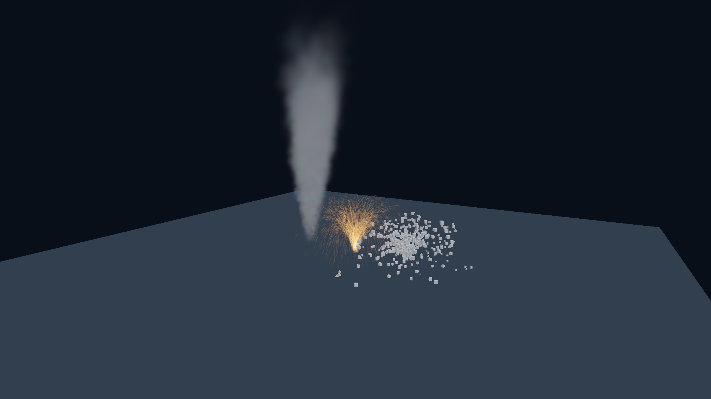

# CPU particles

The optional `c3d_particle` package supplies fixed-pool CPU simulation and particle
effect materials. It publishes ordinary core [billboard batches](billboards.md)
or [mesh instances](instancing.md). Core owns rendering, culling and sorting.

Select `c3d_particle` alongside core in the consumer project, with the normal
renderer/platform dependencies needed by the application. The package itself
imports only core and the standard library.

## Create an emitter

Inside a fallible function with live `assets` and `scene`, importing
`c3d`, `c3d::particle`, `c3d::scene`, `c3d::asset` and `c3d::material`:

```c3
particle::register_particles(&scene)!;
ShaderId shader = particle::add_particle_shader(&assets)!;
MaterialId sparks = particle::add_particle_material(
    assets: &assets,
    shader: shader,
    params: { .color = { 1, 0.6f, 0.1f, 1 }, .soft_distance = 0.2f },
    blend: BlendMode.ADDITIVE,
)!;

ParticleSystemDesc desc = particle::default_particle_system_desc();
desc.capacity = 4096;
desc.material = sparks;
desc.render_mode = ParticleRenderMode.STRETCHED;
desc.shape = EmitterShape.CONE;
desc.radius = 0.1f;
desc.rate = 200;
desc.speed = { .min = 3, .max = 6 };
desc.lifetime = { .min = 1, .max = 2 };
desc.gravity_scale = 1;
desc.stretch = 0.05f;
Node* emitter = scene.add_particle_system(desc, name: "sparks")!;
emitter.local.position = { 0, 1, 0 };
scene.update_world();
```

Register once before adding systems. Registration can fault `CAPACITY_EXCEEDED`;
destroy the scene after a partial registration failure. Emitter creation itself
is atomic: it validates the descriptor, allocates one pool and creates the
emitter plus one draw child, rolling back on failure. Invalid descriptors return
`INVALID_ARGUMENT`; scene capacity failure returns `CAPACITY_EXCEEDED`.

## Frame order and ownership

After animation/physics and any emitter edits:

```c3
scene.update_world();
particle::update(&scene, delta_seconds, wind_velocity);
```

Render every camera afterward. Rendering does not advance the simulation.
`wind_velocity` is application-owned world-space air velocity in metres/second.
Hidden emitters continue simulating. Their WORLD/identity draw child inherits
visibility and subtree lifetime; update explicitly copies the emitter's layer
mask because layers are not inherited.

The descriptor is captured at creation and remains immutable. Runtime controls
are `ParticleSystem.emitting`, `emit_burst(count)`, emitter transforms and wind.
Material values use the ordinary asset revision API. Recreate a system to change
its capacity, emission configuration, render mode or asset references.

The library owns the pool arrays, counters, PRNG state and draw child. Inspect
them as short-lived component borrows; do not resize/edit the arrays or remove,
reparent or replace the owned child independently. Removing the emitter or scene
releases pool and draw storage immediately. Removing only ParticleSystem frees
the pool; the next `particle::update` removes the orphan draw child, so run that
update before rendering. Shared materials, shaders, textures and mesh geometry
remain in the asset store.

## Emission and simulation

Positions and velocities are world-space after emission. Emitter scale affects
spawn volume, while sampled speed remains in world metres/second. Subsequent
emitter motion does not carry existing particles.

- POINT uses the origin and uniform sphere directions.
- BOX samples its volume and independent sphere directions.
- SPHERE samples uniform volume and outward directions.
- CONE samples a disk at local Y=0 and a uniform solid angle about +Y.

Rate emission retains a fractional accumulator. Bursts are queued and remain
effective while `emitting` is false. Full pools skip requests and accumulate
`dropped`; the counters saturate instead of wrapping. Dropped requests do not
consume PRNG draws and never cause work proportional to their count.

Each update clamps simulated time to 0.1 seconds, expiring existing particles
before accepting emission. Accepted newborns participate in that step's
integration and leave it with age equal to the clamped duration. Newborns with
already-exhausted lifetime expire without a replacement in the same step. A
zero-duration update consumes bursts and publishes age-zero particles.

Velocity receives gravity, then drag toward wind; position uses that updated
velocity. Expiry swap-removes every stream together. Equal seeds/configuration
and identical emitter-pose, delta and wind sequences replay identically within
the same build. There is no cross-compiler/version bitwise guarantee.

The seed is encoded as four little-endian bytes for Sfc32Random. Unit samples
use the high 24 bits of its integer output. Shape draws precede lifetime, speed,
size, rotation, spin and the particle's colour seed. Equal scalar endpoints still
consume a draw. Colour is reconstructed from the stored seed with fixed integer
hashes, then multiplied by the eight-sample colour table. Scalar and colour
tables linearly interpolate normalized age/lifetime.

## Draw modes and materials

BILLBOARD uses square camera-facing quads. STRETCHED supplies core with world
velocity as direction and full dimensions `(size, size + speed * stretch)`;
core handles per-camera projection and the zero/parallel-direction fallback.
Rotation is an extra in-plane turn. MESH publishes the supplied geometry/material
with uniform scale and rotation about world +Y. Mesh particles inherit that
material's alpha/depth behaviour; they do not cast shadows or trace in this
delivery. Zero-area/zero-scale output is omitted without removing the simulated
particle. Pick indices identify compacted draw records, not stable particles.

`add_particle_shader` creates a shared fragment-only shader using core's depth
snapshot. `add_particle_material` copies a 32-byte payload and creates a blended,
depth-tested, double-sided material with depth writes off. Slot 0 is an optional
sprite map. `ParticleMaterialParams.color` multiplies particle/texture colour.

`soft_distance > 0` fades coverage over the scene-depth gap. Zero disables the
fade, retaining hardware depth testing. The shader still declares depth reads,
so setting soft distance to zero does not remove its snapshot requirement.
Empty/hidden batches make no draw or snapshot request.

UNLIT keeps the input radiance. AMBIENT multiplies it by scene ambient plus core
diffuse indirect illumination, including the environment or selected probe
volume. Fog uses `apply_material_fog` before coverage is premultiplied exactly
once. ADDITIVE adds coverage-scaled RGB and preserves destination alpha.

Simulation is inline, with no allocation during normal step/update. The pool is
one aligned allocation of eight capacity-sized streams; core separately owns
draw arrays and persistent GPU records. GPU simulation, collision, ribbons,
flipbooks, sub-emitters, serialization and parallel execution are outside this
delivery. Core billboard material restrictions are documented separately.

## Example and measurements

```powershell
python scripts/build.py --example particles
python scripts/build.py --target particles --opt O3
addons/c3d_particle.c3l/build/particles.exe --benchmark --frames 300
```

Linux uses `build/particles` without `.exe`. The window shows smoke, additive
stretched sparks and mesh debris, with emitting/burst controls, wind, smoke
lighting/soft distance, spark blending and a second camera. Validation is always
enabled. `--frames N` closes an interactive smoke test after N frames.

The headless benchmark uses one 1920x1080 display-output view without AA, 60
rendered warm-up frames and 300 measured frames per segment. Active simulation
is prewarmed for twenty simulated seconds. It reports actual live counts and
matches delayed GPU results to the measured frame range. `--capture-rgba path`
saves the last display-encoded RGBA8 image for inspection.

Measured on September 30, 2026: Windows x64, NVIDIA GeForce RTX 4090, C3 0.8.3
`-O3`, Vulkan validation on, GPU+INTERNAL profiling, inline simulation. Means over
300 frames; GPU measurements also contain 300 matched samples.

| Metric | Empty systems | Active systems |
| --- | ---: | ---: |
| Particle update CPU | 0.000326 ms | 0.108573 ms |
| Whole frame CPU | 1.035607 ms | 1.436521 ms |
| Instance sort GPU | Not recorded | 0.055815 ms |
| Transparent pass GPU | Not recorded | 0.185436 ms |
| Live smoke, mean / capacity | 0 / 8192 | 8169.7 / 8192 |
| Live sparks, mean / capacity | 0 / 4096 | 4083.2 / 4096 |
| Live debris, mean / capacity | 0 / 1024 | 1020.9 / 1024 |

These are this scene's measurements, not a general performance guarantee. The
measured CPU update is below the 1 ms executor follow-up threshold; parallel
execution was not implemented or measured.

Windows acceptance passed all 16 particle CPU tests and six Vulkan cases, with
validation. Native Linux compilation and all 16 CPU tests also passed in WSL.
WSL GPU acceptance remains unverified: both the test run and independent
`vulkaninfo --summary` probes stalled in the local Vulkan environment.


